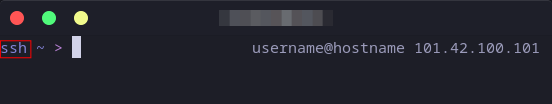
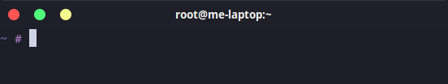
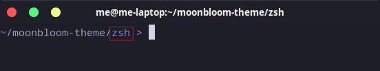
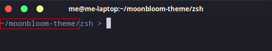
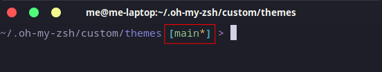
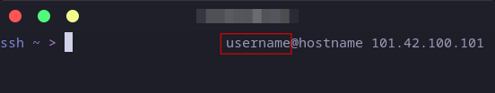
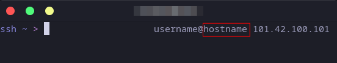
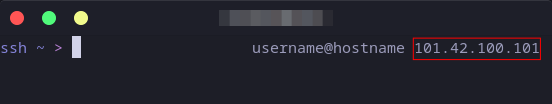

## Configuration

All settings can be configured via the `moonbloom.conf` file in your theme directory.  
You'll find examples and default values in [moonbloom.conf](https://github.com/moonbloom-theme/zsh/blob/main/moonbloom.conf).

> [!NOTE]
> **For colors** you can use standard names (`blue`, `red`, `cyan`, etc.), 8- or 16-bit codes, or hex values (`#ff00ff`).

### SSH Indicator
- `SSH_INDICATOR_TEXT` — the text that shows up when you're in an SSH session 

Default: `"ssh"`



- `SSH_INDICATOR_COLOR` — color of the SSH indicator text.

Default: `"blue"`

- `SHOW_SSH_INDICATOR` — turn SSH indicator on or off (`true`/`false`).

Default: `"true"`

### Prompt Symbol
- `CUSTOM_PROMPT_SYMBOL` — what symbol to show for regular users

Default: `">"`


- `CUSTOM_PROMPT_SYMBOL_SUPER_USER` — symbol for root/sudo users

Default: `"#"`



- `CUSTOM_PROMPT_SYMBOL_COLOR` — color of the prompt symbol.

Default: `"magenta"`

### Path Colors
- `CURRENT_DIR_COLOR` — color for your current working directory.

Default: `"blue"`



- `TAIL_PATH_COLOR` — color for the rest of the path (parent directories).

Default: `"white"`




### Git and Mercurial (Hg) Extensions



- `GIT_PROMPT_BRACKETS_COLOR` — color of the brackets around your git branch name.

Default: `"cyan"`

- `GIT_PROMPT_BRANCH_COLOR` — color of git branch name.

Default: `"green"`

- `GIT_PROMPT_ASTERISK_COLOR` — color of the asterisk (*) that shows when you have uncommitted changes.

Default: `"yellow"`

- `HG_PROMPT_BRACKETS_COLOR` — color of brackets around hg branch.

Default: `"cyan"`

- `HG_PROMPT_BRANCH_COLOR` — color of hg branch name.

Default: `"green"`

- `HG_PROMPT_ASTERISK_COLOR` — color of hg changes indicator (*).

Default: `"yellow"`


### Virtual Environment
- `VIRTUALENV_COLOR` — color for your active Python virtual environment name.

Default: `"cyan"`


### Right Prompt
- `RIGHT_PROMPT_COLOR` — color of the right prompt.

Default: `"white"`

- `SHOW_USERNAME` — display your username or not (`true`/`false`).

Default: `"false"`



- `SHOW_HOST` — show your machine's hostname (`true`/`false`).

Default: `"false"`



- `SHOW_REMOTE_SERVER_IP` — display the IP address when you're connected via SSH (`true`/`false`).

Default: `"false"`




---

## Config Example

```zsh
# ~/.oh-my-zsh/custom/themes/moonbloom.conf

SSH_INDICATOR_TEXT="ssh"
SSH_INDICATOR_COLOR="blue"
SHOW_SSH_INDICATOR="true"

CUSTOM_PROMPT_SYMBOL=">"
CUSTOM_PROMPT_SYMBOL_SUPER_USER="#"
CUSTOM_PROMPT_SYMBOL_COLOR="magenta"

CURRENT_DIR_COLOR="blue"
TAIL_PATH_COLOR="white"

GIT_PROMPT_BRANCH_COLOR="green"
GIT_PROMPT_ASTERISK_COLOR="yellow"

RIGHT_PROMPT_COLOR="white"
SHOW_USERNAME="true"
SHOW_HOST="true"
SHOW_REMOTE_SERVER_IP="true"
```

---

## FAQ

**Where should I put the config file?**  
Put it in the same folder as your theme, typically:  
`~/.oh-my-zsh/custom/themes/moonbloom.conf`

**How do I find my themes folder?**  
Just run this command:
```sh
echo "${ZSH_CUSTOM:-${ZSH:-~/.oh-my-zsh}/custom}/themes/"
```

**My changes aren't showing up! What do I do?**  
First, make sure your theme and config paths are right. Then either restart your terminal or run `source ~/.zshrc` or `exec zsh`.
