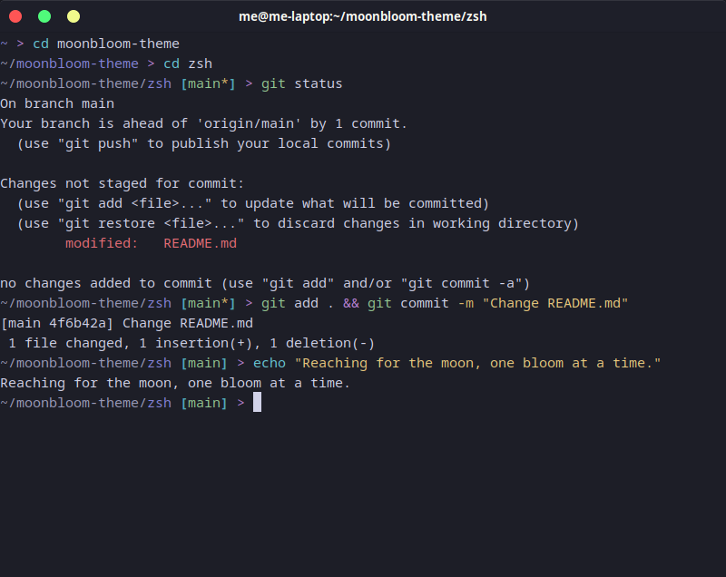

  <h1>Moonbloom for <a href="https://zsh.org/">Zsh</a></h1>
  
Gentle on the eyes, evoking the cozy tranquility of a serene night.

  <a href="https://github.com/moonbloom-theme/moonbloom">Homepage</a> • <a href="https://moonbloom.teplostanski.dev">Website</a> • <a href="https://github.com/orgs/moonbloom-theme/discussions">Discussions</a> • <a href="https://donate.teplostanski.dev">Support Us</a>

 

> The [Z shell (Zsh)](https://zsh.org/) is a Unix shell that can be used as an interactive login shell and as a command interpreter for shell scripting. Zsh is an extended Bourne shell with many improvements, including some features of Bash, ksh, and tcsh.

> [!NOTE]
> This repository contains a Zsh theme that adapts to the color scheme of your terminal emulator.

## Install
See [INSTALL.md](./INSTALL.md)

## Team

This theme is maintained by the following person(s) and a bunch of [awesome contributors](https://github.com/moonbloom-theme/zsh/graphs/contributors).

<!--CONTRIBUTORS_TABLE--><table><tr>
  <td align="center">
    <a href="https://github.com/teplostanski" title="Игорь Теплостанский">
      
     <b>Игорь Теплостанский</b>
    </a>
  </td>
</tr></table><!--CONTRIBUTORS_TABLE-END-->

 

  
  

